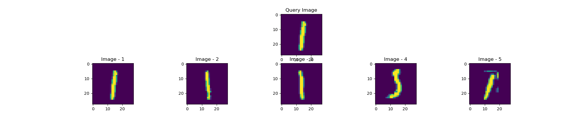

# Dataset
The Dataset for the implemented Image Based Search Engine is a sebset of MNIST Dataset, with 9 instances of each class.
# Implemented Logic
Encoder.h5 file acts as the encoder. It is trained on MNIST dataset, and represents the image as a vector of legth 128. This encoder is used to extract the features from the image.
A query image is then fetched and the feature for the query image is extracted using the encoder model. This is the compared with the features of the images in our dataset.
The closest 5 images from the data is displayed to the user.  

